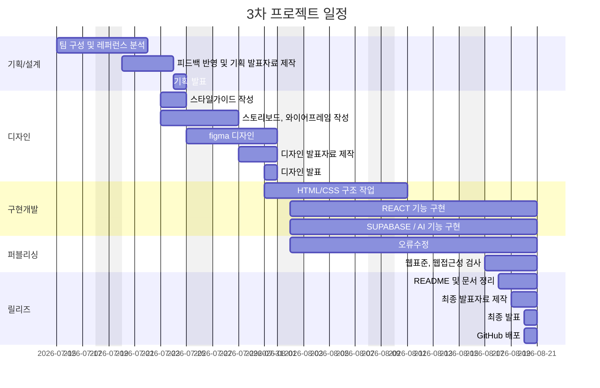

# 한끼랩 (3차 프로젝트)

- 과정명: 프론트엔드 13기 개발자 양성
- 기간: 2026/04/07 ~ 2026/08/21
- 3차 프로젝트: 2026/07/15 ~ 2026/08/21

## 🔗 빠른 링크

- ⚙️ 개발 컨벤션(노션) : [5조 한끼연구소](https://app.notion.com/p/oreumi/7-39febaa8982b8049b894fcd3b05ec4f1)
- 📑 기획서(피그마 슬라이드): [기획서] (https://www.figma.com/slides/uawhVhg1eTzhXLcoq8Nmyc)
- 🎨 디자인 원본: [피그마] https://www.figma.com/design/b758BtZOYApbJJXB2hqSpE/7%EC%A1%B0-%ED%94%BC%EA%B7%B8%EB%A7%88?node-id=0-1&t=f5ifrSUpquykABNI-1

## 1. 프로젝트 개요

### 1.1 목표

- 특정 알레르기나 비건 식단을 하는 사람들의 기존 식단 검색 한계 극복
- AI 기반 맞춤형 레시피 솔루션 제공

### 1.2 👥 팀원

|           이름           | 역할                                                |                        GitHub                        |
| :----------------------: | :-------------------------------------------------- | :--------------------------------------------------: |
| **황시원** <br> _(팀장)_ | 기획 / 디자인 / 레시피 상세 퍼블리싱                |        [@isnow-x](https://github.com/isnow-x)        |
|        **김정우**        | 디자인 / 메인 / 레시피 목록 퍼블리싱                |     [@casperjwk](https://github.com/casperjwk/)      |
|        **김찬희**        | 기획 / 디자인 / 마이페이지 / 즐겨찾기 퍼블리싱      | [@ckck912ck-lang](https://github.com/ckck912ck-lang) |
|        **최성호**        | 기획 / 디자인 / 로그인 / 회원가입 / 관리자 퍼블리싱 |     [@yebin-1129](https://github.com/yebin-1129)     |
|        **최예빈**        | 기획 / 디자인 / 메인 / 헤더 / 푸터 퍼블리싱         | [@RONNIECHOI0324](https://github.com/RONNIECHOI0324) |

### 1.3 🗓️ 마일스톤



## 2. 개발 환경 및 배포

### 2.1 개발 스택

#### Frontend

☑️ React(vite)

#### Tools

- ☑️ Version Control: Git & GitHub
- ☑️ Design: Figma
- ☑️ Editor: VS Code

### 2.2 배포 URL

- https://est-fe-13-3rd-project-xi.vercel.app/

## 3. 프로젝트 구조

## 📁 프로젝트 구조

```text
EST-fe-13-3rd-project/
│
├─ public/                              # 빌드 과정 없이 그대로 제공되는 정적 파일
│  └─ images/
│
├─ src/
│  │
│  ├─ assets/                          # 컴포넌트에서 import하여 사용하는 이미지
│  │
│  ├─ components/                       # 여러 페이지에서 재사용하는 UI 컴포넌트
│  │  │
│  │  ├─ common/                        # 사이트 전체 공통 컴포넌트
│  │  │  ├─ Header.jsx                 # 로그인 상태와 내비게이션을 표시하는 헤더
│  │  │  ├─ Footer.jsx                 # 사이트 정보와 링크를 표시하는 푸터
│  │  │  ├─ Badge.jsx                  # 안전·주의·대체 가능 등의 상태 배지
│  │  │  ├─ MainLayout.jsx             # Header, 페이지, Footer 공통 레이아웃
│  │  │  ├─ MainLayout.module.css      # 공통 레이아웃 스타일
│  │  │  └─ common.module.css          # Header, Footer, Badge 공통 스타일
│  │  │
│  │  └─ recipe/                        # 레시피 관련 공통 컴포넌트
│  │     ├─ RecipeCard.jsx              # 레시피 정보와 즐겨찾기 기능을 제공하는 카드
│  │     ├─ RecipeCardSkeleton.jsx      # 레시피 로딩 중 표시하는 스켈레톤 카드
│  │     ├─ RecipeFilter.jsx            # 알레르기·비건 유형을 선택하는 필터 패널
│  │     ├─ recipeCard.module.css       # 레시피 카드 및 스켈레톤 스타일
│  │     └─ recipeFilter.module.css     # 레시피 필터 패널 스타일
│  │
│  ├─ pages/                            # 라우터를 통해 표시되는 페이지 단위 화면
│  │  │
│  │  ├─ home/
│  │  │  ├─ HomePage.jsx               # 히어로 배너와 맞춤·인기 레시피를 제공하는 메인 페이지
│  │  │  ├─ HomePage.module.css        # 메인 페이지 스타일
│  │  │  ├─ FavoriteRecipeCard.jsx     # 메인 페이지용 즐겨찾기 레시피 카드
│  │  │  └─ FavoriteRecipeCard.module.css
│  │  │                                  # 즐겨찾기 레시피 카드 스타일
│  │  │
│  │  ├─ recipe/
│  │  │  ├─ RecipeListPage.jsx         # 검색·정렬·필터·더보기 기능이 있는 레시피 목록
│  │  │  ├─ RecipeListPage.module.css  # 레시피 목록 페이지 스타일
│  │  │  ├─ RecipeDetailPage.jsx       # 재료, 조리법, 안전 분석, AI 대체 레시피 상세 화면
│  │  │  └─ RecipeDetailPage.module.css
│  │  │                                  # 레시피 상세 페이지 스타일
│  │  │
│  │  ├─ my/
│  │  │  ├─ MyPage.jsx                 # 프로필·식단 조건·최근 본 레시피·회원 탈퇴 관리
│  │  │  ├─ MyPage.module.css          # 마이페이지 스타일
│  │  │  ├─ FavoritePage.jsx           # 즐겨찾기 레시피 조회·필터·페이지네이션 화면
│  │  │  └─ FavoritePage.module.css    # 즐겨찾기 페이지 스타일
│  │  │
│  │  ├─ auth/
│  │  │  ├─ LoginPage.jsx              # 이메일 로그인과 사용자 프로필 초기화 처리
│  │  │  ├─ LoginPage.module.css       # 로그인 페이지 스타일
│  │  │  ├─ SignupPage.jsx             # 단계별 회원가입 과정과 Supabase 저장 처리
│  │  │  ├─ SignupPage.module.css      # 회원가입 전체 레이아웃 스타일
│  │  │  ├─ SignupStep1.jsx            # 계정 및 기본 정보 입력 단계
│  │  │  ├─ SignupStep1.module.css     # 회원가입 1단계 스타일
│  │  │  ├─ SignupStep2.jsx            # 알레르기 및 비건 유형 선택 단계
│  │  │  └─ SignupStep2.module.css     # 회원가입 2단계 스타일
│  │  │
│  │  ├─ admin/
│  │  │  ├─ AdminPage.jsx              # 관리자 권한 확인 및 관리자 메뉴 구성
│  │  │  ├─ AdminPage.module.css       # 관리자 페이지 공통 레이아웃 스타일
│  │  │  ├─ DashboardSection.jsx       # 회원·알레르기·비건·레시피 통계 요약
│  │  │  ├─ DashboardSection.module.css
│  │  │  │                                # 관리자 통계 카드 스타일
│  │  │  ├─ DashboardChart.jsx         # 월별 회원 및 알레르기 통계 차트
│  │  │  ├─ UserDietSection.jsx        # 회원별 식단·알레르기·즐겨찾기 정보 조회
│  │  │  ├─ UserDietSection.module.css # 회원 식단 관리 화면 스타일
│  │  │  ├─ SystemSettingsSection.jsx  # 관리자 시스템 설정 조회 및 변경
│  │  │  ├─ SystemSettingsSection.module.css
│  │  │  │                                # 시스템 설정 화면 스타일
│  │  │  ├─ RecipeCreatePage.jsx       # 관리자용 레시피·재료·조리 단계 등록 화면
│  │  │  └─ RecipeCreatePage.css       # 레시피 등록 페이지 스타일
│  │  │
│  │  └─ notfound/
│  │     ├─ NotFoundPage.jsx            # 존재하지 않는 경로의 404 안내 페이지
│  │     └─ NotFoundPage.module.css     # 404 페이지 스타일
│  │
│  ├─ services/                         # Supabase 데이터 및 Edge Function 통신 로직
│  │  ├─ recipeService.js              # 레시피 조회·등록·이미지 업로드·추천 조회
│  │  ├─ recipeSearchService.js        # 레시피 목록 조회 및 정렬
│  │  ├─ favoriteService.js            # 즐겨찾기 등록·삭제·조회 및 개수 집계
│  │  ├─ recentViewService.js          # 최근 본 레시피 기록 및 조회
│  │  ├─ aiRecipeService.js            # AI 맞춤 레시피 생성과 캐시 조회
│  │  └─ adminAccess.js                # 로그인 사용자와 관리자 권한 확인
│  │
│  ├─ utils/                            # 데이터 가공 및 공통 비즈니스 로직
│  │  ├─ recipeFilter.js               # 알레르기·비건 조건에 따른 레시피 필터링
│  │  └─ recipeSafety.js               # 사용자 식단 조건과 레시피 안전 상태 분석
│  │
│  ├─ context/                          # React Context 기반 전역 상태
│  │  ├─ AuthContext.jsx               # 로그인 세션과 사용자 프로필 상태 관리
│  │  └─ SettingsContext.jsx           # 관리자 시스템 설정 상태 관리
│  │
│  ├─ lib/
│  │  └─ supabase.js                   # 환경 변수를 이용한 Supabase 클라이언트 생성
│  │
│  ├─ styles/
│  │  ├─ reset.css                     # 브라우저 기본 스타일 초기화
│  │  ├─ normalize.css                 # 브라우저별 스타일 차이 보정
│  │  └─ global.css                    # 색상·글꼴 등 사이트 전역 스타일
│  │
│  ├─ App.jsx                          # Context Provider 및 전체 페이지 라우팅 설정
│  ├─ App.css                          # App 컴포넌트 기본 스타일
│  ├─ main.jsx                         # React 애플리케이션 진입점
│  └─ index.css                        # 앱 시작 시 불러오는 최상위 스타일
│
├─ supabase/                            # Supabase 로컬 설정 및 서버리스 함수
│  ├─ functions/
│  │  ├─ _shared/
│  │  │  └─ cors.ts                    # Edge Function 공통 CORS 헤더
│  │  │
│  │  ├─ generate-custom-recipe/
│  │  │  └─ index.ts                   # 식단 조건에 맞는 AI 대체 레시피 생성·캐싱
│  │  │
│  │  ├─ answer-recipe-question/
│  │  │  └─ index.ts                   # 레시피 문맥을 활용한 AI 질의응답 처리
│  │  │
│  │  └─ delete-account/
│  │     └─ index.ts                   # 사용자 관련 데이터와 인증 계정 삭제
│  │
│  ├─ config.toml                      # Supabase 로컬 개발 환경 설정
│  └─ README.md                        # Edge Function 환경 변수·실행·배포 안내
│
├─ .env.local                          # Supabase URL과 공개 키 등 로컬 환경 변수
├─ .gitignore                          # Git에서 제외할 파일과 디렉터리 설정
├─ .oxlintrc.json                      # Oxlint React 린트 규칙
├─ index.html                          # React 앱이 삽입되는 HTML 문서
├─ package.json                        # 프로젝트 정보·스크립트·패키지 의존성
├─ package-lock.json                   # 설치된 패키지 버전 고정
├─ vite.config.js                      # React 플러그인을 포함한 Vite 설정
├─ vercel.json                         # SPA 라우팅을 위한 Vercel 재작성 설정
└─ README.md                           # 프로젝트 소개 및 실행 방법 문서

```

## 4. 향후 개선 사항

- 알레르기 정보 등록 범위 확대
- 개인화 기능 확대
- 사용자 참여형 레시피 등록 기능 확대
- 관리자 및 데이터 관리 고도화

## 5. 기획/디자인 문서

- **기획서(피그마 슬라이드)**: 사용자 흐름 설계, 리뉴얼 방향성, 스타일 가이드, 개발 기준 및 주요 구현 내용
  링크: https://www.figma.com/slides/uawhVhg1eTzhXLcoq8Nmyc
- **디자인 원본(피그마)**: 컴포넌트, 컬러/타이포 스케일, 반응형 레이아웃, 아이콘
  링크: https://www.figma.com/design/b758BtZOYApbJJXB2hqSpE/7%EC%A1%B0-%ED%94%BC%EA%B7%B8%EB%A7%88?node-id=0-1&t=fuEzoJAz4MN8fruz-1
